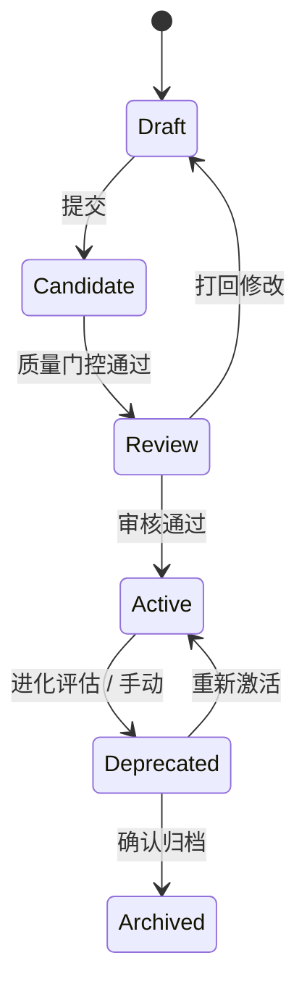

# Ch09. 知识生命周期 — 6 态状态机

> Draft → Candidate → Review → Active → Deprecated → Archived — 每条知识的完整旅程。

## 本章概要

AutoSnippet 的知识不是静态存储，而是有明确生命周期的活体。本章解析 6 态状态机的设计、状态转换规则和转换触发条件。

## 6 态状态图

## 每个状态的语义

<!-- TODO: 各状态的详细定义 -->
<!-- TODO: 状态转换的前置条件 -->

## 转换触发机制

<!-- TODO: 自动触发 vs 手动触发 -->
<!-- TODO: Evolution 服务的自动衰退评估 -->

## 关键代码

<!-- TODO: 状态机实现 -->
<!-- TODO: 转换守卫 -->

## 小结

<!-- TODO -->

::: tip 下一章
[Ch10. 11 维健康评估](./ch10-dimension)
:::
